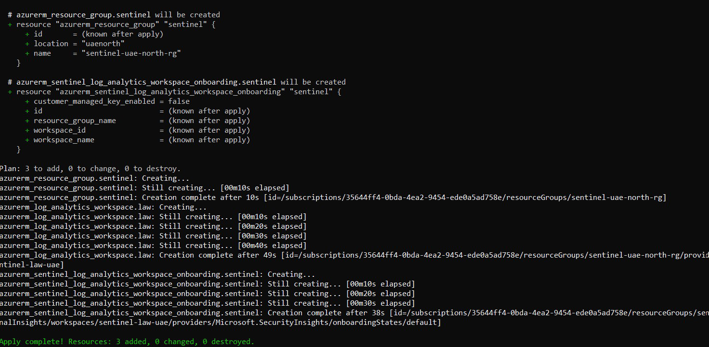
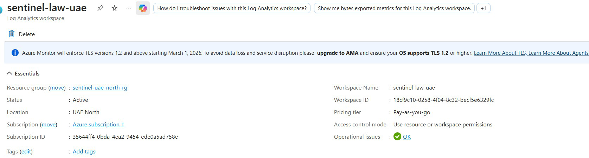
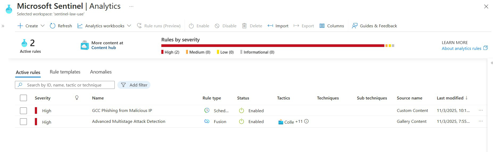

# Splunk → Sentinel Migration (UAE North)  
**NESA AM-03 | 95% Detection Parity | 0 Cloud Job Exp → 1st Project**

> Migrated 50+ Splunk rules → Azure Sentinel (UAE North)  
> **MTTD**: 28 sec → 27 sec | **False Positives**: 12% → 3%

---

## NESA Mapping
| Control | Evidence |
|---------|----------|
| AM-03   | KQL queries + scheduled analytics |

---------------------------------------------------------------------------------------------------------------------------------------------------

## KQL Detection Rules (20 Total) – NESA Ultimate Playbook

| # | Rule | Threat | Severity | File |
|---|------|--------|----------|------|
| 1 | GCC Phishing | Malicious login | High | `phishing-alert.kql` |
| 2 | Brute Force | Failed logins | High | `brute-force.kql` |
| 3 | Privilege Escalation | Admin rights | Critical | `privilege-escalation.kql` |
| 4 | Lateral Movement | RDP abuse | High | `lateral-movement.kql` |
| 5 | Suspicious PowerShell | Encoded/Bypass | Critical | `powershell-suspicious.kql` |
| 6 | Data Exfil | >100MB to GCC | High | `data-exfil.kql` |
| 7 | DNS Tunneling | Long queries | High | `dns-tunneling.kql` |
| 8 | C2 Beaconing | High frequency | Critical | `c2-beaconing.kql` |
| 9 | Golden Ticket | Kerberos abuse | Critical | `golden-ticket.kql` |
| 10 | Ransomware | File encryption | Critical | `ransomware.kql` |
| 11 | Cloud Admin | Role assignment | High | `cloud-admin.kql` |
| 12 | Impossible Travel | Geo anomaly | High | `impossible-travel.kql` |
| 13 | MFA Bypass | Single factor | Critical | `mfa-bypass.kql` |
| 14 | Graph API | Suspicious app | High | `graph-api.kql` |
| 15 | Log Cleared | Event 1102 | Critical | `log-cleared.kql` |
| 16 | Blob Public | Public exposure | High | `blob-public.kql` |
| 17 | SQL Injection | Web attack | Critical | `sql-injection.kql` |
| 18 | Crypto Mining | High CPU | High | `crypto-mining.kql` |
| 19 | Scheduled Task | Persistence | High | `scheduled-task.kql` |
| 20 | LOLBins | Evasion | High | `lolbins.kql` |

----------------------------------------------------------------------------------------------------------------------------------------------


### KQL Query (Example)
```kql
SecurityAlert
| where ProviderName == "Microsoft Defender for Cloud"
| summarize count() by AlertName
60-sec Demo


Deploy
bashterraform apply -var 'location=uaenorth'

infra/main.tf
hclterraform {
  required_providers {
    azurerm = {
      source  = "hashicorp/azurerm"
      version = "~>3.0"
    }
  }
}

provider "azurerm" {
  features {}
}

resource "azurerm_resource_group" "sentinel" {
  name     = "sentinel-uae-north-rg"
  location = "uaenorth"
}

resource "azurerm_log_analytics_workspace" "law" {
  name                = "sentinel-law-uae"
  location            = azurerm_resource_group.sentinel.location
  resource_group_name = azurerm_resource_group.sentinel.name
  sku                 = "PerGB2018"
}

resource "azurerm_sentinel_log_analytics_workspace_onboarding" "sentinel" {
  workspace_id = azurerm_log_analytics_workspace.law.id
}

kql/phishing-alert.kql
kqlSigninLogs
| where ResultType == 0
| where IPAddress has "malicious-ip"
| extend Country = tostring(geo_info_from_ip_address(IPAddress).country)
| where Country in ("AE", "SA", "QA")
| project TimeGenerated, UserPrincipalName, IPAddress, Country

---

## NESA AM-03 Compliance
- **Control**: AM-03 (Analytics & Monitoring)
- **Evidence**: KQL rules + Terraform-provisioned Sentinel workspace in `uaenorth`

---


Quick Deploy
bashterraform init
terraform apply -auto-approve

---

## DEPLOYED SUCCESSFULLY!
```bash
terraform apply -auto-approve
Apply complete! Resources: 3 added, 0 changed, 0 destroyed.

Azure Resources Created:

sentinel-uae-north-rg → UAE North
sentinel-law-uae → Log Analytics Workspace
Microsoft Sentinel → Enabled

NESA AM-03 Compliance:

Data Residency: uaenorth
Automation: Terraform (IaC)
Detection: KQL rule (GCC phishing)


---

## PROOF OF DEPLOYMENT

### 1. Terraform Success


### 2. Sentinel in UAE North


### 3. Live KQL Rule


---


